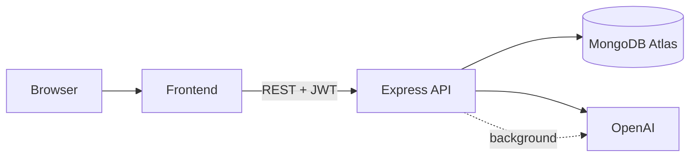

# Trao — AI Travel Planner

Trip planner with AI-generated day-by-day itineraries, budget estimates, and hotel suggestions.

**Live:** https://trao-itinerary-frontend.onrender.com  
**API:** https://trao-itinerary.onrender.com  
**Repo:** https://github.com/amaykorade/Trao-Itinerary  
**Demo:** https://drive.google.com/file/d/1SEyMQVod6OZ_eO29Xruy73mWjWKkw_FF/view?usp=sharing

## Features

- Email/password and Google sign-in
- Create trips from destination, length (1–14 days), budget tier, and interests
- Async AI generation — start a trip, leave the page, return when ready
- Edit activities, reorder within a day, regenerate one day or the full trip
- Version history before regenerating (restore previous plans)
- Read-only share links (`/share/:token`)
- Finalize trips to lock edits

## Stack

Next.js · TypeScript · Tailwind · Express · MongoDB · OpenAI GPT-4o-mini · Render

Both frontend and backend run as Render Web Services (Next.js needs server routes for `/trips/[id]` and `/share/[token]`).

## Architecture



Trip creation returns immediately with `status: generating`. OpenAI runs in-process on the server; the frontend polls `GET /api/trips/:id` until the itinerary is ready.

## Auth

- Email/password with bcrypt; Google via server-verified ID token
- JWT (7 days) in `localStorage`, sent as `Bearer` on API calls
- All trip routes scoped by `userId` from the token
- Share links are public read-only (`GET /api/share/:token`)

## AI design

- **Model:** `gpt-4o-mini` with strict JSON schema output
- **Full trip:** itinerary, USD budget breakdown, 3 hotel tiers
- **Day regen:** single day with context from other days to avoid duplicates
- Activity IDs assigned server-side after generation

## Custom features

**Async generation** — avoids blocking the browser for 15–30s OpenAI calls; no Redis queue (simpler deploy, jobs not durable across restarts).

**Version history** — snapshot before regenerate; restore any of the last 10 versions.

**Share + finalize** — send a read-only link; lock the plan when done.

## Trade-offs

| Choice | Why |
|--------|-----|
| MongoDB | Nested itinerary documents |
| JWT | Stateless API, no session store |
| gpt-4o-mini | Cheaper; structured output is reliable enough |
| In-process async | No Redis; good for single-instance Render |
| Rate limits | 15 AI calls/user/hour in production |

## Limitations

- Render free tier cold starts (~30s after idle)
- Generation lost if server restarts mid-job (stale `generating` → `failed` after 10 min)
- AI budgets are estimates, not live pricing
- USD only; no email verification

## Local setup

Node 20+, MongoDB, OpenAI key.

```bash
cd backend && npm install && cp .env.example .env
cd ../frontend && npm install && cp .env.example .env.local
```

**Backend `.env`:** `MONGODB_URI`, `JWT_SECRET`, `CORS_ORIGIN=http://localhost:3000`, `OPENAI_API_KEY`, optional `GOOGLE_CLIENT_ID`

**Frontend `.env.local`:** `NEXT_PUBLIC_API_URL=http://localhost:3001`, optional `NEXT_PUBLIC_GOOGLE_CLIENT_ID`

```bash
cd backend && npm run dev   # :3001
cd frontend && npm run dev  # :3000
```

## Deploy

See [`render.yaml`](render.yaml). Summary:

| | Backend | Frontend |
|--|---------|----------|
| Root | `backend` | `frontend` |
| Build | `npm install --include=dev && npm run build && npm prune --omit=dev` | same |
| Start | `npm start` | `npm start` |

**Env (production):**

- Backend: `MONGODB_URI`, `JWT_SECRET`, `OPENAI_API_KEY`, `CORS_ORIGIN=https://trao-itinerary-frontend.onrender.com`
- Frontend: `NEXT_PUBLIC_API_URL=https://trao-itinerary.onrender.com` (no trailing slash)

Redeploy frontend after changing `NEXT_PUBLIC_*` (baked in at build time).

**Google OAuth origins:** `http://localhost:3000`, `https://trao-itinerary-frontend.onrender.com`
